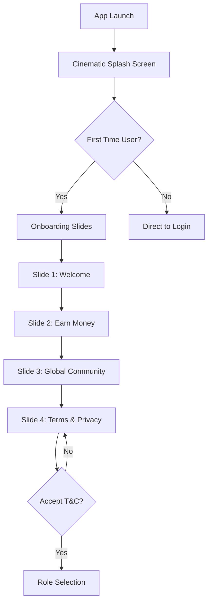

# XUM AI - User Experience Flow
**Complete User Journey Mapping**

---

## 🎯 User Types

1. **Contributors**: Individuals earning by completing AI training tasks
2. **Companies**: Enterprises posting tasks and managing projects
3. **Admins**: Platform moderators ensuring quality and fairness

---

## 🚀 First-Time User Journey (Contributor)

### Phase 1: Discovery & Onboarding



**Screens Involved**:
1. `SplashScreen` (3 seconds)
   - Scanning → Drawing → Stabilizing animation
   - Neural interface establishment theme
   
2. `OnboardingScreen` (4 slides)
   - Swipeable carousel
   - Dynamic floating task cards
   - Mandatory T&C checkbox
   - Skip disabled until final slide

3. `Role Selection` (Embedded in onboarding)
   - Contributor (Earner) path
   - Company (Hirer) path

---

### Phase 2: Authentication

```
Role Selection
  ↓
AuthScreen (Login/Signup Tabs)
  ├─ Login Flow:
  │   ├─ Email + Password entry
  │   ├─ Password visibility toggle
  │   ├─ "Forgot Password?" link → ForgotPasswordScreen
  │   └─ Submit → [Future] POST /api/v1/auth/login
  │
  ├─ Signup Flow:
  │   ├─ Name + Email + Password + Confirm Password
  │   ├─ Password strength indicator
  │   ├─ Visual validation (green checkmarks)
  │   └─ Submit → [Future] POST /api/v1/auth/signup
  │
  └─ Social Auth:
      └─ "Continue with Google" button
```

**Password Recovery Flow**:
```
Forgot Password Screen
  ↓
Enter Email → Submit
  ↓
OTPScreen (4-digit Neural Validation)
  ↓
Enter OTP → Verify
  ↓
[Future] Reset Password Screen
  ↓
Return to Login
```

**Success State**:
```
Authentication Complete
  ↓
Store JWT Token (localStorage/secure cookies)
  ↓
Navigate to HOME
  ↓
Personalized Greeting: "Welcome back, [Name]"
```

---

## 🏠 Daily Active User Journey

### Phase 1: Dashboard Arrival

```
HomeScreen
├─ Top Section:
│   ├─ Greeting: "Good Morning, Alex"
│   ├─ Quick Stats:
│   │   ├─ Balance: $1,240.50
│   │   ├─ Today's Earnings: +$12.50
│   │   └─ XP Progress: 840/1000 (Level 5)
│   └─ Notification Bell (unread count badge)
│
├─ Featured Section:
│   ├─ "High Priority Tasks" (horizontal scroll)
│   └─ 3-4 urgent tasks with reward badges
│
├─ Recommended Modules:
│   ├─ Linguasense Hub (language tasks)
│   ├─ XUM Judge (AI evaluation)
│   └─ RLHF Training
│
└─ Bottom Navigation:
    └─ Home | Tasks | Wallet | Profile | Settings
```

**Key Interactions**:
- Tap task card → `TaskDetailsScreen`
- Tap wallet icon → `WalletScreen`
- Tap notification bell → `NotificationsScreen`
- Pull-to-refresh → Reload featured tasks

---

### Phase 2: Task Discovery & Execution

#### Step 1: Marketplace Browse

```
TaskMarketplaceScreen
├─ Search Bar:
│   └─ "Search neural contracts..."
│
├─ Filter System:
│   ├─ Toggle Button → Advanced Filters Panel
│   ├─ Filter Options:
│   │   ├─ Task Type: Audio, Image, Text, Validation
│   │   ├─ Difficulty: Easy, Medium, Hard
│   │   └─ Reward Range: $0-$5, $5-$20, $20+
│   └─ Apply Filters
│
└─ Task Grid:
    ├─ Task Card 1: "Label Street Signs" - $2.50, 15 min
    ├─ Task Card 2: "Audio Transcription" - $5.00, 30 min
    └─ Task Card 3: "Validate Translations" - $3.00, 20 min
```

**Filter Logic**:
```javascript
filteredTasks = tasks.filter(task => {
  if (selectedType && task.type !== selectedType) return false;
  if (selectedDifficulty && task.difficulty !== selectedDifficulty) return false;
  if (task.reward < minReward || task.reward > maxReward) return false;
  return true;
});
```

#### Step 2: Task Details

```
TaskDetailsScreen ("Mission Brief")
├─ Task Header:
│   ├─ Title: "Audio Transcription - Medical Terms"
│   ├─ Reward: $5.00 | XP: 50 | Time: ~30 min
│   └─ Difficulty Badge: "Medium"
│
├─ Description:
│   └─ "Listen to medical audio clips and transcribe spoken terms..."
│
├─ Requirements:
│   ├─ Quiet environment
│   ├─ Headphones recommended
│   └─ English proficiency required
│
└─ Action Buttons:
    ├─ "Accept Mission" (Primary CTA)
    └─ "Back to Marketplace"
```

**Decision Point**:
```
Tap "Accept Mission"
  ↓
Navigate to Type-Specific Execution Screen:
  - Audio → CaptureAudioScreen
  - Image → MediaCaptureScreen
  - Text → TextInputTaskScreen
  - Validation → ValidationTaskScreen
  - RLHF → RLHFCorrectionTaskScreen
```

#### Step 3: Task Execution (Audio Example)

```
CaptureAudioScreen
├─ Header:
│   ├─ Task title
│   ├─ Progress: "Recording 1 of 5"
│   └─ Timer: "00:00"
│
├─ Recording Interface:
│   ├─ Waveform Visualization (real-time)
│   ├─ Recording State:
│   │   ├─ Idle → "Tap to Start Recording"
│   │   ├─ Recording → Pulsing red circle
│   │   └─ Paused → "Resume" button
│   └─ Controls:
│       ├─ Record/Pause Button
│       ├─ Stop Button
│       └─ Playback Preview
│
└─ Submission:
    ├─ Validation: Min 5 seconds, max 2 minutes
    ├─ "Submit Recording" button (disabled until valid)
    └─ Progress to next clip or final submission
```

**Submission Flow**:
```
All recordings complete
  ↓
TaskSubmissionScreen
  ├─ Review recordings
  ├─ Add optional notes
  └─ "Submit Final Work" button
  ↓
[Future] POST /api/v1/submissions
  ↓
handleCompleteTask(reward: 5, xp: 50)
  ↓
Update State:
  - balance: $1240.50 → $1245.50
  - history: Add "+$5.00 Task Reward"
  ↓
Navigate to TaskSuccessScreen
```

#### Step 4: Success Celebration

```
TaskSuccessScreen
├─ Checkmark Animation:
│   └─ Green glow pulse (500ms)
│
├─ Reward Display:
│   ├─ "+$5.00" (count-up animation)
│   ├─ "+50 XP" (progress bar fill)
│   └─ "New Balance: $1,245.50"
│
├─ Confetti Particles (800ms)
│
└─ Action Buttons:
    ├─ "Find More Tasks" → TaskMarketplaceScreen
    └─ "View Wallet" → WalletScreen
```

---

### Phase 3: Wallet Management

```
WalletScreen
├─ Balance Display:
│   ├─ Large Typography: "$1,245.50"
│   ├─ Available Balance (after pending withdrawals)
│   └─ Withdraw Button (Primary CTA)
│
├─ Quick Stats:
│   ├─ Total Earned: "$4,820.00"
│   ├─ Total Withdrawn: "$3,600.00"
│   └─ Pending Payouts: "$0.00"
│
└─ Transaction History:
    ├─ Tab Filter: All | Earnings | Withdrawals
    └─ Transaction List:
        ├─ "Task Reward: Image Labeling" +$2.50 (Today)
        ├─ "Withdrawal to PayPal" -$100.00 (Yesterday)
        └─ "Quality Bonus" +$5.00 (Nov 12)
```

**Withdrawal Flow**:
```
Tap "Withdraw" button
  ↓
WithdrawScreen
├─ Method Selection:
│   ├─ PayPal (radio button)
│   ├─ Bank Transfer
│   └─ Crypto Wallet (USDC)
│
├─ Amount Input:
│   ├─ Input field with $ prefix
│   ├─ Min: $5.00
│   ├─ Max: Current balance
│   └─ Quick Amounts: $10, $25, $50, All
│
├─ Account Details:
│   └─ Email/Account input (method-specific)
│
└─ Confirmation:
    ├─ "Withdraw $50.00 to PayPal"
    ├─ Processing time: "1-3 business days"
    └─ "Confirm Withdrawal" button
  ↓
handleWithdraw(50, 'paypal')
  ↓
Update State:
  - balance: $1245.50 → $1195.50
  - history: Add "-$50.00 Withdrawal to PayPal"
  ↓
Success Toast: "Withdrawal request submitted!"
  ↓
Navigate back to WalletScreen
```

---

### Phase 4: Profile & Gamification

```
ProfileScreen
├─ Avatar + Level Badge:
│   ├─ Profile Picture (upload option)
│   └─ Level 5 (Gold frame)
│
├─ Stats Grid:
│   ├─ Precision (Accuracy): 94.2%
│   ├─ Tasks Completed: 127
│   ├─ Current Streak: 7 days
│   └─ Trust Score: 8.5/10
│
├─ Achievements Section:
│   ├─ "First Task" ✓
│   ├─ "Week Warrior" ✓
│   └─ "Master Linguist" (locked)
│
└─ Referral Code:
    ├─ "Invite Friends, Earn $5"
    └─ Code: "ALEX2025" (copy button)
```

**Leaderboard Access**:
```
Bottom Navigation → Leaderboard
  ↓
LeaderboardScreen
├─ Time Filter: Daily | Weekly | All-Time
├─ Category: All Tasks | Audio | Image | Text
└─ Ranking List:
    ├─ #1 Sarah Chen - 4,820 XP
    ├─ #2 Marcus Lee - 4,150 XP
    ├─ You (#12) - 840 XP
    └─ #20 ...
```

---

## 🏢 Company User Journey

### Phase 1: Authentication & Dashboard

```
Role Selection → Company
  ↓
Company Auth (Separate from contributors)
  ↓
Company Dashboard
├─ Project Overview:
│   ├─ Active Projects: 3
│   ├─ Total Budget: $50,000
│   └─ Budget Utilized: $12,450 (24.9%)
│
├─ AI Efficiency Metrics:
│   ├─ Average Task Completion Time: 18 min
│   ├─ Quality Score: 92%
│   └─ Worker Retention: 85%
│
└─ Quick Actions:
    ├─ "Create New Project"
    ├─ "Review Submissions"
    └─ "Download Reports"
```

### Phase 2: Task Creation

```
CreateTaskScreen
├─ Task Details:
│   ├─ Title: "Label Product Images"
│   ├─ Description: Rich text editor
│   ├─ Type: Image Labeling
│   └─ Difficulty: Medium
│
├─ Budget Settings:
│   ├─ Reward per Task: $2.50
│   ├─ Number of Tasks: 1000
│   ├─ Total Budget: $2,500
│   └─ XP Reward: 25 per task
│
├─ Requirements:
│   ├─ Minimum Trust Score: 7.0
│   ├─ Minimum Level: 3
│   └─ Language: English
│
└─ Deadline:
    ├─ Start Date: Jan 1, 2025
    ├─ End Date: Jan 15, 2025
    └─ Priority: High
  ↓
Submit → [Future] POST /api/v1/tasks
  ↓
Task Published (appears in marketplace)
```

---

## 🛡️ Admin User Journey

### Phase 1: Admin Authentication

```
Special URL: /admin
  ↓
AdminLoginScreen
├─ Email: admin@xum-ai.com
├─ Password: [Secure admin password]
└─ 2FA Code (optional)
  ↓
Verify Credentials
  ↓
AdminDashboardScreen
```

### Phase 2: Moderation Workflow

```
AdminDashboardScreen
├─ Overview Cards:
│   ├─ Pending Reviews: 24
│   ├─ Active Users: 8,542
│   ├─ Flagged Tasks: 3
│   └─ Pending Payouts: $12,450
│
└─ Quick Access:
    ├─ User Management → UserManagementScreen
    ├─ Task Moderation → TaskModerationScreen
    └─ Payouts → AdminPayoutsScreen
```

**User Management**:
```
UserManagementScreen
├─ Search/Filter:
│   ├─ Search by name/email
│   └─ Filter: All | Active | Suspended | Banned
│
├─ User List:
│   ├─ User Card:
│   │   ├─ Name, Email, Join Date
│   │   ├─ Balance, Tasks Completed
│   │   └─ Trust Score, Status
│   └─ Actions:
│       ├─ View Details
│       ├─ Suspend Account
│       └─ Ban User (with reason)
│
└─ Bulk Actions:
    └─ Export user data (CSV)
```

**Task Moderation**:
```
TaskModerationScreen
├─ Filter: Pending | Flagged | Rejected
├─ Submission Queue:
│   └─ Submission Card:
│       ├─ Task: "Audio Transcription #4827"
│       ├─ User: Alex M. (Trust Score: 8.5)
│       ├─ Submitted: 2 hours ago
│       ├─ Preview: Audio player/image viewer
│       └─ Flags: "Low quality audio" (automated)
│
└─ Review Actions:
    ├─ Approve → Mark as `approved`
    ├─ Reject → Mark as `rejected` (with reason)
    └─ Request Revision → Back to user
```

**Payout Processing**:
```
AdminPayoutsScreen
├─ Pending Withdrawals:
│   └─ Withdrawal Request Card:
│       ├─ User: Sarah Chen
│       ├─ Amount: $150.00
│       ├─ Method: PayPal (sarah@email.com)
│       ├─ Requested: Jan 5, 2025
│       └─ Actions:
│           ├─ Approve → Process payment
│           └─ Reject → Return funds
│
└─ Batch Processing:
    ├─ Select All (checkbox)
    └─ "Approve Selected" → Bulk approve
```

---

## 🔄 Edge Cases & Error Handling

### Network Errors

```
API Call Fails
  ↓
Show Error Toast:
  - "Connection lost. Please try again."
  - Retry button
  ↓
Log error to Sentry (future)
```

### Insufficient Balance (Withdrawal)

```
User attempts to withdraw $500
Balance: $245.50
  ↓
Validation Error:
  - Red border on input
  - "Insufficient funds. Max: $245.50"
  - Disable submit button
```

### Task Timeout

```
User exceeds time limit (e.g., 60 min for 30-min task)
  ↓
Auto-save progress (if possible)
  ↓
Show Warning Modal:
  - "Task expired. Submit partial work?"
  - Options: Submit | Discard
```

### Submission Rejection

```
Admin rejects submission
  ↓
Notification sent to user
  ↓
NotificationsScreen:
  - "Task #4827 was rejected. Reason: Incomplete audio."
  - Action: "View Details"
  ↓
Option to re-attempt task (if allowed)
```

---

## 📊 User Flow Metrics

### Key Performance Indicators

1. **Onboarding Completion Rate**:
   - Target: >85% complete all 4 slides
   - Measure: (Users who reach HOME) / (Total app opens)

2. **Task Completion Rate**:
   - Target: >70% of accepted tasks submitted
   - Measure: (Submissions) / (Tasks accepted)

3. **Withdrawal Success Rate**:
   - Target: >95% of withdrawals processed within 3 days
   - Measure: (Approved withdrawals) / (Total withdrawal requests)

4. **Average Session Duration**:
   - Target: 15-20 minutes (optimal for task completion)
   - Measure: Time from app open to close

5. **User Retention**:
   - Day 1: 70%
   - Day 7: 50%
   - Day 30: 30%

---

## 🎨 Interaction Patterns Summary

### Navigation Gestures
- **Tap**: Primary interaction (buttons, cards)
- **Swipe**: Onboarding slides, tab switching
- **Pull-to-refresh**: Reload dashboard data
- **Long-press**: (Future) Quick actions on task cards

### Feedback Mechanisms
- **Visual**: Button scale on press, loading spinners
- **Haptic**: (iOS) Vibration on success/error
- **Audio**: (Optional) Success chime on task completion
- **Toast Notifications**: Bottom-edge alerts for non-critical updates

### Loading States
- **Skeleton Screens**: For dashboard cards
- **Spinners**: Button loading (submit forms)
- **Progress Bars**: Task execution (audio recording, image upload)

---

**Last Updated**: December 30, 2025  
**UX Designer**: XUM AI Product Team  
**Version**: 1.0
